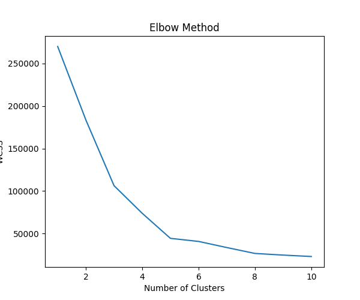
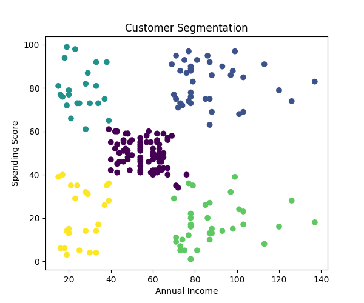

# 🚀 PRODIGY_ML_02  
## 🛍️ Customer Segmentation using K-Means Clustering  

Welcome to my Machine Learning internship project developed as part of the **Prodigy InfoTech Internship Program**. This project focuses on analyzing customer purchasing behavior using **K-Means Clustering**, an Unsupervised Machine Learning algorithm used to identify meaningful customer groups for business intelligence and targeted marketing strategies.

---

# 📌 Project Overview  

Customer segmentation is one of the most powerful applications of Machine Learning in business analytics. In this project, customers are grouped based on:

- 💰 Annual Income  
- 🛒 Spending Score  

The goal is to identify different categories of customers and help businesses improve customer targeting, marketing strategies, and decision-making through data-driven insights.

---

# 🧠 Machine Learning Algorithm Used  

## 🔹 K-Means Clustering  

K-Means is an Unsupervised Machine Learning algorithm that groups similar data points into clusters based on patterns and similarities.

This project includes:
- ✅ Elbow Method for optimal cluster selection
- ✅ Customer behavior analysis
- ✅ Data visualization
- ✅ Cluster prediction & segmentation

---

# ⚙️ Technologies Used  

| Technology | Purpose |
|---|---|
| Python | Core Programming |
| Pandas | Data Processing |
| Matplotlib | Data Visualization |
| Scikit-learn | Machine Learning |
| VS Code | Development Environment |
| Git & GitHub | Version Control |

---

# 📂 Dataset Used  

📌 Mall Customers Dataset  

The dataset contains customer information including:
- Customer ID
- Gender
- Age
- Annual Income
- Spending Score

---

# 📊 Project Outputs  

## 🔹 Elbow Method Visualization  

Used to determine the optimal number of clusters for customer segmentation.

```markdown

```

---

## 🔹 Customer Segmentation Result  

Visual representation of grouped customers using K-Means clustering.

```markdown

```

---

# 💻 Installation & Execution  

## Clone Repository

```bash
git clone https://github.com/your-username/PRODIGY_ML_02.git
```

## Navigate to Folder

```bash
cd PRODIGY_ML_02
```

## Install Dependencies

```bash
pip install pandas matplotlib scikit-learn
```

## Run Project

```bash
python main.py
```

---

# 🌟 Key Features  

✅ Customer Segmentation using ML  
✅ K-Means Clustering Implementation  
✅ Elbow Method Analysis  
✅ Cluster Visualization  
✅ Real-world Dataset Handling  
✅ Business Insight Generation  

---

# 📈 Key Learnings  

✨ Unsupervised Machine Learning  
✨ Clustering Algorithms  
✨ Customer Behavior Analysis  
✨ Data Visualization Techniques  
✨ Machine Learning Workflow  
✨ GitHub Project Deployment  

---

# 🎯 Internship Task Objective  

Create a K-Means Clustering algorithm to group retail store customers based on their purchase history and spending behavior.

---

# 👩‍💻 Author  

## KAYALVIZHI J  

Machine Learning Enthusiast | Full Stack Developer | Passionate about AI, Data Science & Intelligent Systems  

---

# ⭐ If you found this project useful, consider giving it a star on GitHub!
